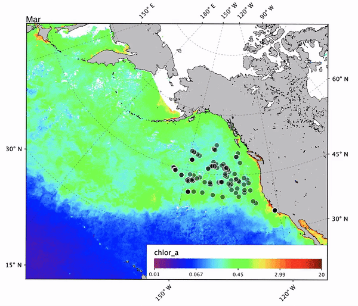

# ESS141
Tools and resources put together for my final project for ESS141 at Stanford.

Feel free to use these tools yourself with proper credit, although I'll admit they are very niche and unoptimized. They were just meant to get me the numbers and images I needed. If you yourself are taking ESS141 at Stanford, I'd recommend checking with your professor before using any of these tools for your project.

`wod_to_shiptrack.c` converts a file list of CSVs of World Ocean Database cast data to a SeaBASS shiptrack file that is openable in programs like SeaDAS as vector data.

`aggregate_monthly.sh` calls a compiled `wod_to_shiptrack` for each month in 2007 to aggregate all of the casts for that month and year into 12 SeaBASS shiptrack files.

`avg_chlor_a_at_seabass.c` is a heretofore unfinished tool, which was planned to average chlor_a values in a NetCDF file of ocean color data at provided vector values from a SeaBASS file, since SeaDAS didn't seem to have any tools for such a thing.

`finalAPBgif.gif` is an animation of my results, as only stills could be included in the final paper.

